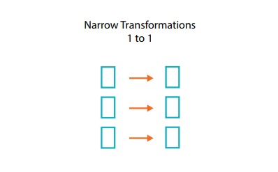
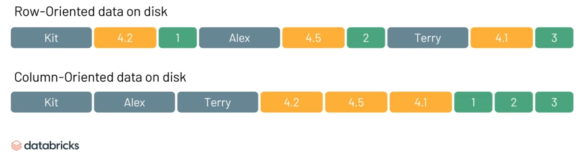
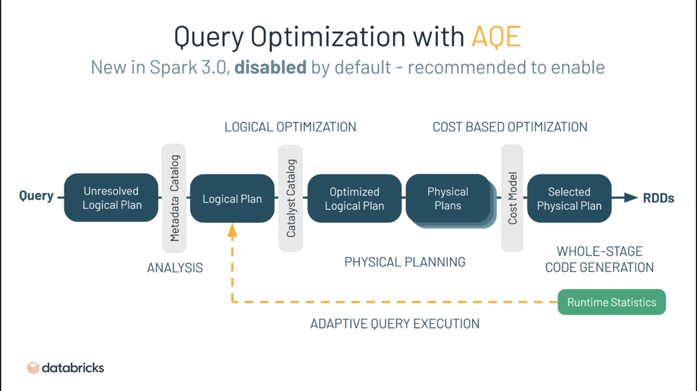
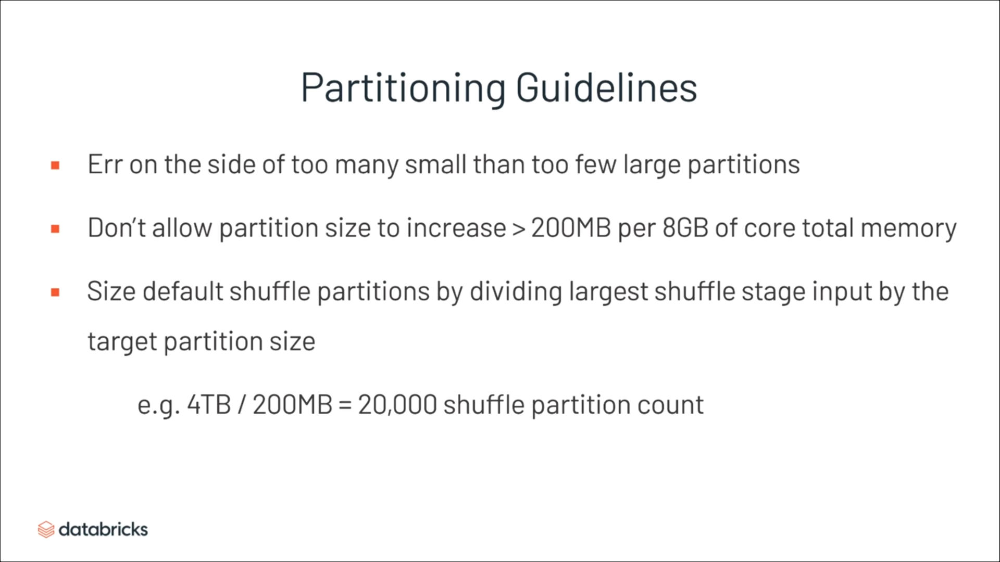

#  Spark Learning Guide

### This material has been created using multiple sources from the internet like Databricks blogs and courses, official docs, Stack Overflow, Learning Spark 2.0 and The Definitive Guide.  

#### You can use this guide to learn about different components of Spark and as a reference material. This section covers all the topics that should be enough for you to get started with Spark Theory.  

#### You can refer to the advanced topics here -

- [Optimization Techniques](advanced/optimizations.md)
- [Joins Internal Working](advanced/joins.md)  
- [Delta Lake](advanced/deltalake.md)
- [Spark 3.0](advanced/new_in_spark_3.md)
--------------------------
1. What is Spark?  
Apache Spark is a cluster computing platform designed to be fast and general-purpose. At its core, Spark is a “computational engine” that is responsible for scheduling, distributing, and monitoring applications consisting of many computational tasks across many worker machines or a computing cluster.
--------------------------
2. What is a Spark Core?  
Spark Core contains the basic functionality of Spark, including components for task scheduling, memory management, fault recovery, interacting with storage systems, and more. Spark Core is also home to the API that defines resilient distributed datasets (RDDs), which are Spark’s main programming abstraction. RDDs represent a collection of items distributed across many compute nodes that can be manipulated in parallel. Spark Core provides many APIs for building and manipulating these collections.
--------------------------
3. Key features of Spark -
- Spark can run over multiple file systems.
- Multiple software systems need not run to achieve a single task because spark provides a lot of capabilities under the hood. A single application can leverage streaming, ML and Spark SQL capabilities of spark.
- Spark has the philosophy of tight integration where each component is designed to interoperate closely. Hence any improvements at the lower level improve all the libraries running over it. 
- Spark offers in-memory computations
--------------------------
4. Major libraries that constitute the Spark Ecosystem -  
Spark MLib- Machine learning library in Spark for commonly used learning algorithms like clustering, regression, classification, etc.
Spark Streaming – This library is used to process real-time streaming data.
Spark GraphX – Spark API for graph parallel computations with basic operators like joinVertices, subgraph, aggregateMessages, etc.
Spark SQL – Helps execute SQL like queries on Spark data using standard visualization or BI tools.
--------------------------
5. What is an RDD?  
    The main abstraction Spark provides is a *resilient distributed dataset* (RDD), which is a collection of elements partitioned across the nodes of the cluster that can be operated on in parallel.
    
    An RDD is, essentially, the Spark representation of a set of data, spread across multiple machines, with APIs to let you act on it. An RDD could come from any data source, e.g. text files, a database via JDBC, etc.
    
    Definition - *RDDs are fault-tolerant, parallel data structures that let users explicitly persist intermediate results in memory, control their partitioning to optimize data placement, and manipulate them using a rich set of operators.*

6. How are RDDs created?  
    Spark provides two ways to create RDDs: 
    
      - loading an external dataset 
      - parallelizing a collection in your driver program.
--------------------------
7. What is a partition?  
A partition is a logical or small chunk of a large distributed data set. It provides the possibility to distribute the work across the cluster, divide the task into smaller parts, and reduce memory requirements for each node. **Partition is the main unit of parallelism in Apache Spark**.
--------------------------
8. How is an RDD fault-tolerant?  
When a set of operations happen on an RDD the spark engine views these operations as a DAG. If a node processing the RDD crashes and was performing operations X->Y->Z on the RDD and failed at Z, then the resource manager assigns a new node for the operation and the processing begins from X again using the directed graph.
--------------------------
9. Why are RDDs immutable?  
Immutability rules out a big set of potential problems due to updates from multiple threads at once. Immutable data is safe to share across processes.  
They're not just immutable but a deterministic function (a function that returns the same result with the same input) of their input. This plus immutability also means the RDD's parts can be recreated at any time. This makes caching, sharing and replication easy.  
These are significant design wins, at the cost of having to copy data rather than mutate it in place. Generally, that's a decent tradeoff to make: gaining the fault tolerance and correctness with no developer effort is worth spending memory and CPU on since the latter are cheap.  
A Corollary: immutable data can as easily live in memory as on disk. This makes it reasonable to easily move operations that hit the disk to instead use data in memory, and again, adding memory is much easier than adding I/O bandwidth.
--------------------------
10. What are Transformations?  
Spark Transformations are functions that produce a new RDD from an existing RDD. An RDD Lineage is built when we apply Transformations on an RDD. Basic Transformations are - map and filter. After the transformation, the resultant RDD is always different from its parent RDD. It can be smaller (e.g. filter, count, distinct, sample), bigger (e.g. `flatMap(), union(), Cartesian()`) or the same size (e.g. map).  
- Narrow dependency : RDD operations like `map(), union(), filter()` can operate on a single partition and map the data of that partition to the resulting single partition. These kinds of operations that map data from one to one partition are referred to as Narrow operations. Narrow operations don’t require distributing the data across the partitions. Each partition of the parent RDD is used by at most one partition of the child RDD.  

  

- Wide dependency : RDD operations like `groupByKey, distinct, join` may require mapping the data across the partitions in the new RDD. These kinds of operations which maps data from one to many partitions are referred to as Wide operations
  Each partition of the parent RDD may be depended on by multiple child partitions.

  
--------------------------
11. What are Actions?  
Actions are RDD operations that produce non-RDD values. They materialize a value in a Spark program. In other words, an RDD operation that returns a value of any type but `RDD[T]` is an action. They trigger the execution of RDD transformations to return values. Simply put, an action evaluates the RDD lineage graph.  
Actions are one of two ways to send data from executors to the driver (the other being accumulators).  
Some examples of actions are - `aggregate, collect, count, countApprox, countByValue, first, fold, foreach, foreachPartition, max, min, reduce, saveAs* actions, saveAsTextFile, saveAsHadoopFile, take, takeOrdered, takeSample, toLocalIterator, top, treeAggregate, treeReduce`
--------------------------
[Anatomy of Spark Application - Luminousmen](https://luminousmen.com/post/spark-anatomy-of-spark-application)

12. What is a driver?  
The driver process runs your main() function, sits on a node in the cluster, and is responsible for three things: maintaining information about the Spark Application; responding to a user’s program or input; and analyzing, distributing, and scheduling work across the executors (defined momentarily).

​		In a single databricks cluster, there will only be one driver irrespective of the number of executors.

- Prepares Spark Context
- Declares operations on the RDD using Transformations and Actions. 
- Submits serialized RDD graph to master.  
[Spark Driver - Stackoverflow](https://stackoverflow.com/a/24638280)  
--------------------------
13. What is a Task?  
A task is a unit of work that can be run on a partition of a distributed dataset and gets executed on a single executor. The unit of parallel execution is at the task level. All the tasks within a single stage can be executed in parallel.
--------------------------
14. What is a Stage?  

    A stage is a collection of tasks that can run in parallel. A new stage is created when there is data shuffling. 
--------------------------
15. What is a Core?  
A core is a basic computation unit of a CPU and a CPU may have one or more cores to perform tasks at a given time. The more cores we have, the more work we can do. In spark, this controls the number of parallel tasks an executor can run.
--------------------------
16. What is Hadoop, Hive, Hbase?  
Hadoop is basically 2 things: a Distributed FileSystem (HDFS) + a Computation or Processing framework (MapReduce). Like all other FS, HDFS also provides us with storage, but in a fault-tolerant manner with high throughput and lower risk of data loss (because of the replication). But, being an FS, HDFS lacks random read and write access. This is where HBase comes into the picture. It's a distributed, scalable, big data store, modelled after Google's BigTable. It stores data as key/value pairs.  
Hive: It provides us with data warehousing facilities on top of an existing Hadoop cluster. Along with that, it provides an SQL like interface which makes your work easier, in case you are coming from an SQL background. You can create tables in Hive and store data there. Along with that you can even map your existing HBase tables to Hive and operate on them.
--------------------------
17. What is parquet?    
[Parquet and it's pros and cons - Stackoverflow](https://stackoverflow.com/a/36831549/8515731)



- The schema is stored in the footer of the file
- Doesn't waste space storing missing value
- Has predicate pushdown
- Loads only required columns
- Allows data skipping	

--------------------------
18. What file systems do Spark support?  
- Hadoop Distributed File System (HDFS).
- Local File system.
- S3
--------------------------
19. What is a Cluster Manager?  
An external service for acquiring resources on the cluster (e.g. standalone manager, Mesos, YARN). Spark is agnostic to a cluster manager as long as it can acquire executor processes and those can communicate with each other. We are primarily interested in Yarn as the cluster manager. A spark cluster with Yarn as a cluster/resource manager can run in either yarn cluster or yarn-client mode:
yarn-client mode – A driver runs on client process, Application Master is only used for requesting resources from YARN.
yarn-cluster mode – A driver runs inside the application master process, the client goes away once the application is initialized  
[Cluster Mode Overview - Spark Documentation](https://spark.apache.org/docs/latest/cluster-overview.html)
--------------------------
20. What is yarn?    
    [What is Yarn - Hadoop Documentation](https://hadoop.apache.org/docs/current/hadoop-yarn/hadoop-yarn-site/YARN.html)    
    A good guide to understand how Spark works with YARN - 
    - [Spark on YARN: A Deep Dive - Sandy Ryza - Youtube](https://youtu.be/N6pJhxCPe-Y)
    - [Spark over Yarn - Stackoverflow](https://stackoverflow.com/questions/24909958/spark-on-yarn-concept-understanding)
--------------------------
21. What is MapReduce?  
[Introduction to MapReduce - Guru99](https://www.guru99.com/introduction-to-mapreduce.html)
--------------------------
22. Spark vs MapReduce?  
[Spark vs MapReduce - Medium @bradanderson](https://medium.com/@bradanderson.contacts/spark-vs-hadoop-mapreduce-c3b998285578)
--------------------------
23. What is an Executor?  
    An executor is a single JVM process that is launched for an application on a worker node. Executor runs tasks and keeps data in memory or disk storage across them. Each application has its own executors. A single node can run multiple executors and executors for an application can span across multiple worker nodes. An executor stays up for the duration of the Spark Application and runs the tasks in multiple threads. The number of executors for a spark application can be specified inside the SparkConf or via the flag –num-executors from the command line.
    - Executor performs all the data processing.
    - Reads from and writes data to external sources.
    - Executor stores the computed data in-memory, cache or on hard disk drives.
    - Interacts with the storage systems.
--------------------------
24. What are workers, executors, cores in the Spark Standalone cluster?  

    A worker node hosts the executor process. It has a fixed number of executors allocated at any point in time. Each executor will hold the chunk of the data to be processed. This chunk is called a partition.

    Spark parallelizes at two levels - first with the executors and second with the cores allocated to the executors.
    
    [Workers, executors, cores - Stackoverflow](https://stackoverflow.com/questions/32621990/what-are-workers-executors-cores-in-spark-standalone-cluster)
--------------------------
25. Name types of Cluster Managers in Spark.
    The Spark framework supports four major types of Cluster Managers -  
    - Standalone: a basic manager to set up a cluster.  
    - Apache Mesos: generalized/commonly-used cluster manager, also runs Hadoop MapReduce and other applications.  
    - Yarn: responsible for resource management in Hadoop
    - Kubernetes: an open-source system for automating deployment, scaling, and management of containerized applications
--------------------------
26. How can you minimize data transfers when working with Spark?  
    Minimizing data transfers and avoiding shuffling helps write spark programs that run in a fast and reliable manner. The various ways in which data transfers can be minimized when working with Apache Spark are:  
    - Using Broadcast Variable- Broadcast variable enhances the efficiency of joins between small and large RDDs.  
    - Using Accumulators – Accumulators help update the values of variables in parallel while executing.  
    - The most common way is to avoid `ByKey` operations, repartition or any other operations which trigger shuffles.
--------------------------
27. What are broadcast variables?  
    Broadcast variables allow the programmer to keep a read-only variable cached on each machine rather than shipping a copy of it with tasks. They can be used, for example, to give every node a copy of a large input dataset in an efficient manner. Spark also attempts to distribute broadcast variables using efficient broadcast algorithms to reduce communication costs.
    Spark actions are executed through a set of stages, separated by distributed “shuffle” operations. Spark automatically broadcasts the common data needed by tasks within each stage. The data broadcasted this way is cached in serialized form and deserialized before running each task. This means that explicitly creating broadcast variables is only useful when tasks across multiple stages need the same data or when caching the data in the deserialized form is important.
    Broadcast variables are created from a variable v by calling `SparkContext.broadcast(v)`. The broadcast variable is a wrapper around v, and its value can be accessed by calling the value method. The code below shows this:  

    ```python
    >>> broadcastVar = sc.broadcast([1, 2, 3])
    <pyspark.broadcast.Broadcast object at 0x102789f10>
    
    >>> broadcastVar.value
    [1, 2, 3]
    ```
    After the broadcast variable is created, it should be used instead of the value v in any functions run on the cluster so that v is not shipped to the nodes more than once. In addition, the object v should not be modified after it is broadcast in order to ensure that all nodes get the same value of the broadcast variable (e.g. if the variable is shipped to a new node later).
--------------------------
28. Why is there a need for broadcast variables when working with Apache Spark?  
These are read-only variables, present in-memory cache on every machine. When working with Spark, usage of broadcast variables eliminates the necessity to ship copies of a variable for every task, so data can be processed faster. Broadcast variables help in storing a lookup table inside the memory which enhances the retrieval efficiency when compared to an RDD lookup ().  
[Why use broadcast variables? - Stackoverflow](https://stackoverflow.com/questions/26884871/what-are-broadcast-variables-what-problems-do-they-solve)
--------------------------
29. What is a Closure?  
The closure is those variables and methods which must be visible for the executor to perform its computations on the RDD (in this case foreach()). The closure is serialized and sent to each executor. The variables within the closure sent to each executor are copies.  
[Closure Spark Documentation](https://spark.apache.org/docs/2.2.0/rdd-programming-guide.html#understanding-closures-a-nameclosureslinka)
--------------------------
30. What are Accumulators?  
Accumulators are variables that are "added" to through an associative and commutative "add" operation. They act as a container for accumulating partial values across multiple tasks (running on executors). They are designed to be used safely and efficiently in parallel and distributed Spark computations and are meant for distributed counters and sums.  
[Accumulators Spark Documentation](https://spark.apache.org/docs/2.2.0/rdd-programming-guide.html#accumulators)
--------------------------
31. How can you trigger automatic clean-ups in Spark to handle accumulated metadata?  
You can trigger the clean-ups by setting the parameter ‘spark.cleaner.ttl’ or by dividing the long-running jobs into different batches and writing the intermediary results to the disk.
--------------------------
32. What is the significance of Sliding Window operation?  
Sliding Window controls the transmission of data packets between various computer networks. Spark Streaming library provides windowed computations where the transformations on RDDs are applied over a sliding window of data. Whenever the window slides, the RDDs that fall within the particular window are combined and operated upon to produce new RDDs of the windowed DStream.
--------------------------
33. What is a DStream?  
    Discretized Stream is a sequence of Resilient Distributed Databases that represent a stream of data. DStreams can be created from various sources like Apache Kafka, HDFS and Apache Flume. DStreams have two operations –
    - Transformations that produce a new DStream.
    - Output operations that write data to an external system.
--------------------------
34. When running Spark applications, is it necessary to install Spark on all the nodes of YARN cluster?  
Spark need not be installed when running a job under YARN or Mesos because Spark can execute on top of YARN or Mesos clusters without affecting any change to the cluster.
--------------------------
35. What is the Catalyst framework?  
    
    
    
    Catalyst framework is a new optimization framework present in Spark SQL. It allows Spark to automatically transform SQL queries by adding new optimizations to build a faster processing system.
    
    It goes through 4 transformational phases - 
    - Analysis
    - Logical optimization
    - Physical planning
    - Code generation
    
    Phase 1: Analysis  
    Abstract Syntax Tree is generated from dataframe or query
    List of column names, datatypes, functions, databases etc. are resolved or validated by consulting internal ' Metadata Catalog'.
    
    From this analysis, we get a logical plan

    Phase 2: Logical Optimization  
    The logical optimization phase applies standard rule-based optimizations to the logical plan. These include constant folding, predicate pushdown, projection pruning, null propagation, Boolean expression simplification, and other rules.

    Phase 3: Physical Planning  
    At this stage, the catalyst optimizer generates on or more physical plans. This represents what the query engine will actually do. Each physical plan is evaluated according to it's own cost model and the best performing model is selected.
    
    Phase 4: Code generation  
    Generation of efficient java byte code to run on each machine.  
    Spark acts as a compiler facilitated by Project Tungsten for whole stage code generation.  
    Whole stage code generation is physical query optimization, getting rid of virtual function calls and employing CPU registers for intermediate data. This generates a compact RDD for final execution.
    
    [Physical Plans In Spark SQL - Databricks Spark Summit - Part 1](https://youtu.be/99fYi2mopbs)
    
    [Physical Plans In Spark SQL - Databricks Spark Summit - Part 2](https://youtu.be/9EIzhRKpiM8)

--------------------------
36. Which spark library allows reliable file sharing at memory speed across different cluster frameworks?  
Tachyon
--------------------------
37. Explain the different types of transformations on DStreams?  
- Stateless Transformations- Processing of the batch does not depend on the output of the previous batch. Examples- `map ()`, `reduceByKey ()`, `filter ()`.  
- Stateful Transformations- Processing of the batch depends on the intermediary results of the previous batch. Examples- Transformations that depend on sliding windows
--------------------------
37. Explain the popular use cases of Apache Spark
Apache Spark is mainly used for -  
- Iterative machine learning.  
- Interactive data analytics and processing.  
- Stream processing.  
- Batch Processing.
- Sensor data processing.
--------------------------
38. How can you remove the elements with a key present in any other RDD?  
Use the `subtractByKey()` function
--------------------------
39. What is the difference between persist() and cache()?  
`persist()` allows the user to specify the storage levels whereas `cache()` uses the default storage level.
--------------------------
40. What are the various levels of persistence in Apache Spark?  
    Apache Spark automatically persists some intermediary data from various shuffle operations. This is done to avoid recomputing the entire input if a node fails during the shuffle. However, it is often suggested that users call `persist()` method on the RDD in case they plan to reuse it. Spark has various persistence levels to store the RDDs on disk or in memory or as a combination of both with different replication levels.  
    The various storage/persistence levels in Spark are -  
    
    - MEMORY_ONLY  
    - MEMORY_ONLY_SER
    - MEMORY_AND_DISK
    - MEMORY_AND_DISK_SER, DISK_ONLY
    - MEMORY_ONLY_2, MEMORY_AND_DISK_2
    - OFF_HEAP
    
    [Which Storage Level to Choose?](https://spark.apache.org/docs/3.0.0-preview/rdd-programming-guide.html#which-storage-level-to-choose)
--------------------------
41. Does Apache Spark provide checkpointing?  
Lineage graphs are always useful to recover RDDs from failure but this is generally time-consuming if the RDDs have long lineage chains. Spark has an API for checkpointing i.e. a REPLICATE flag to persist. However, the decision on which data to the checkpoint - is decided by the user. Checkpoints are useful when the lineage graphs are long and have wide dependencies.
--------------------------
42. Hadoop uses replication to achieve fault tolerance. How is this achieved in Apache Spark?  
    The data storage model in Apache Spark is based on RDDs. RDDs help achieve fault tolerance through lineage. RDD always has information on how to build from other datasets. If any partition of an RDD is lost due to failure, lineage helps build only that particular lost partition.

    Assuming that all of the RDD transformations are deterministic, the data in the final transformed RDD will always be the same irrespective of failures in the Spark Cluster.
--------------------------
43. Explain the core components of a distributed Spark application.  
Driver - The process that runs the main() method of the program to create RDDs and perform transformations and actions on them.
Executor - The worker processes that run the individual tasks of a Spark job.  
Cluster Manager - A pluggable component in Spark, to launch Executors and Drivers. The cluster manager allows Spark to run on top of other external managers like Apache Mesos or YARN.
--------------------------
44. What do you understand by Lazy Evaluation?  
Spark is intellectual in the manner in which it operates on data. When you tell Spark to operate on a given dataset, it heeds the instructions and makes a note of it, so that it does not forget - but it does nothing, unless asked for the final result. When a transformation like `map()` is called on an RDD- the operation is not performed immediately. Transformations in Spark are not evaluated until you perform an action. This helps optimize the overall data processing workflow.
--------------------------
45. Define a worker node-
A node that can run the Spark application code in a cluster can be called a worker node. A worker node can have more than one worker which is configured by setting the `SPARK_WORKER_INSTANCES` property in the `spark-env.sh` file. Only one worker is started if the SPARK_ WORKER_INSTANCES property is not defined.
--------------------------
46. What do you understand by `SchemaRDD`?  
Spark SQL allows relational queries expressed in SQL or HiveQL to be executed using Spark. At the core of this component is a new type of RDD, `SchemaRDD`. An RDD that consists of row objects (wrappers around the basic string or integer arrays) with schema information about the type of data in each column. A `SchemaRDD` is similar to a table in a traditional relational database.
--------------------------
47. What are the disadvantages of using Apache Spark over Hadoop MapReduce?  
Apache spark does not scale well for compute-intensive jobs and consumes a large number of system resources. Apache Spark’s in-memory capability at times comes a major roadblock for cost-efficient processing of big data. Also, Spark does not have its own file management system and hence needs to be integrated with other cloud-based data platforms or apache Hadoop.
--------------------------
48. What do you understand by Executor Memory in a Spark application?  
Every spark application has the same fixed heap size and a fixed number of cores for a spark executor. The heap size is what referred to as the Spark executor memory which is controlled with the spark.executor.memory property of the `–-executor-memory` flag. Every spark application will have one executor on each worker node. The executor memory is a measure of how much memory of the worker node will the application utilize.
--------------------------
49. What according to you is a common mistake apache-spark developers make when using spark?  
    - [Not avoiding `GroupByKey`](https://databricks.gitbooks.io/databricks-spark-knowledge-base/content/best_practices/prefer_reducebykey_over_groupbykey.html)
    - [Collecting Large Datasets](https://databricks.gitbooks.io/databricks-spark-knowledge-base/content/best_practices/dont_call_collect_on_a_very_large_rdd.html)
    - [Not Dealing with Bad Input](https://databricks.gitbooks.io/databricks-spark-knowledge-base/content/best_practices/dealing_with_bad_data.html)
    - [Not managing shuffle partitions](https://nealanalytics.com/blog/databricks-spark-jobs-optimization-techniques-shuffle-partition-technique-part-1/)
50. (A) Suppose that there is an RDD named `Samplerdd` that contains a huge list of numbers. The following spark code is written to calculate the average -  

    ```scala
    def SampleAvg(x, y):
        return (x+y)/2.0;
    
    avg = Samplerdd.reduce(SampleAvg);
    ```

----------------------------
50. (B) What is wrong with the above code and how will you correct it?  
    The average function is neither commutative nor associative. The best way to compute average is to first sum it and then divide it by count as shown below -  
    
    ```scala
    def sum(x, y):
    	return x+y;
    
    total =Samplerdd.reduce(sum);
    avg = total / Samplerdd.count();
    ```
    However, the above code could lead to an overflow if the total becomes big. So, the best way to compute average is to divide each number by count and then add up as shown below -
    ```scala
    cnt = Samplerdd.count();
    
    def divideByCnt(x):
    	return x/cnt;
    
    myrdd1 = Samplerdd.map(divideByCnt);
    avg = Samplerdd.reduce(sum);
    ```
--------------------------
51. Explain the difference between Spark SQL and Hive.  

    - Spark SQL is faster than Hive.  
    - Any Hive query can easily be executed in Spark SQL but vice-versa is not true.  
    - Spark SQL is a library whereas Hive is a framework.  
    - It is not mandatory to create a metastore in Spark SQL but it is mandatory to create a Hive metastore.  
    - Spark SQL automatically infers the schema whereas in Hive, schema needs to be explicitly declared.  
--------------------------
52. What is a Spark Session?  
The first step of any Spark Application is creating a `SparkSession`, which enables you to run Spark code. 
The `SparkSession` class provides the single entry point to all functionality in Spark using the `DataFrame` API. 
This is automatically created for you in a Databricks notebook/spark shell as the variable, `spark`.
--------------------------
53. Why should one not use a UDF?  
UDFs can not be optimized by the Catalyst Optimizer. To use UDFs, functions must be serialized and sent to executors. And for Python, there is additional overhead of spinning up a Python interpreter on an executor to run a UDF.

​		`sampleUDF = udf(sample_function)` serializes the function and sends the UDF to the executors so that we can use it on a dataframe.

--------------------------
54. What is an `UnsafeRow`?  
    The data that is "shuffled" is in a format known as `UnsafeRow`, or more commonly, the Tungsten Binary Format. `UnsafeRow` is the in-memory storage format for Spark SQL and DataFrames. 

    Advantages include -  

    - Compactness : Column values are encoded using custom encoders, not as JVM objects (as with RDDs).
      The benefit of using Spark custom encoders is that you get almost the same compactness as Java serialization, but significantly faster encoding/decoding speeds.
      For custom data types, it is possible to write custom encoders from scratch.  
    - Efficiency : Spark can operate directly out of Tungsten, without first deserializing Tungsten data into JVM objects.
--------------------------
55. What are some best Caching Practices?  
- Don't cache unless you're sure the DataFrame is going to be used multiple times.  
- Omit unneeded columns to reduce storage footprint.
--------------------------
56. Understanding the Spark UI  

    - Use `setJobDescription` for better tracking in the Spark UI.  

    - Use event timeline to analyze jobs that are taking a long time to execute.  

      - The event timeline for a stage has various tasks including Executor computing time, which btw should be the most occurring in the timeline. Any other coloured tasks are overhead and should be considered if we want to optimize the process. If there's a lot of overhead time then one should consider creating larger partitions of data.  

    - In the Summary Metrics tab, we can see the statistics by quartile for the green tasks in the event timeline. Here we should analyze Duration to see if the partitions are skewed. If the min-max fields show a greater difference, that indicates skewed partitions.  

    - Input Size/Records can also be used in a similar way to analyze where there is a larger difference between the min, median and max sizes of partitions.  

    - Inside the SQL tab, we can click on the job descriptions that we set. This will lead us to a more explanatory visualization mapped to the actual code that we wrote.

      [Spark Web UI - Official Documentation](https://spark.apache.org/docs/3.0.0-preview/web-ui.html)

      [Deep Dive into Monitoring Spark Applications - Jacek Laskowski - YouTube](https://youtu.be/mVP9sZ6K__Y)

      [Spark UI Visualization - Andrew Or - YouTube](https://www.youtube.com/watch?v=VQOKk9jJGcw&list=PL-x35fyliRwif48cPXQ1nFM85_7e200Jp)
--------------------------
57. Shared resources -  
- Executors share machine level resources. That is if a node has 4 executors, all the resources would be shared between those.
- Tasks share executor level resources.  
- Resources are shared by the cores in a single node. Meaning they share the memory, disk, network. If any of the cores under an executor fail because of OOM or any other reason, the whole executor will be affected and the process on that executor will have to be stopped.
--------------------------
58. Local and Global Results -  
    When certain actions and transformations are performed there are scenarios when the tasks operate on a partition individually, and then the same operation needs to be performed again globally to get accurate results. For example, if 5 executors give the record count of each partition to be 4,5,5,6,4 then a final global count operation is needed to say that the dataset has 24 records. More such operations are -

    |Stage 1         |    Stage 2 |
    |----------------|--------------------|
    |Local Filter    |    No Global Filter|
    |Local count     |    Global Count|
    |Local distinct  |    Global distinct|
    |Local sort      |    Global sort|
    |Local aggregate |    Global aggregate|
--------------------------
59. What is shuffling?  
    Shuffling is the process of rearranging data within a cluster between stages.  
    Triggered by wide transformations like -  
    - Repartition  
    - ByKey operations (except counting)  
    - Joins, the worse being cross joins  
    - Sorting  
    - Distinct  
    - GroupBy  
--------------------------
60. What is a dataframe?  
A dataframe is a distributed collection of data grouped into named columns.
--------------------------
61. Why Dataframes and not RDDs?  
The computations are not known to Spark when it happens under an RDD. Whether you are performing a join, filter, select or aggregation, Spark only sees it as a lambda expression. Even the `Iterator[T]` datatype is not visible to spark. That leaves no room for Spark to perform optimizations.
--------------------------
62. Why should you always define your schema upfront when reading a file?  

    - You relieve Spark from the onus of inferring data types.

    - You prevent Spark from creating a separate job just to read a large portion of
    your file to ascertain the schema, which for a large data file can be expensive and
    time-consuming.

    - You can detect errors early if data doesn’t match the schema.

--------------------------
63. Managed vs Unmanaged tables?  
    For a managed table, spark manages both the data in the file store (HDFS, S3, etc.) and the metadata for the table. While for unmanaged data, spark only manages the metadata and you manage the data yourself in a external data source such as Cassandra. So for a command like `DROP TABLE` spark will only delete the metadata for the unmanaged table.

    Unmanaged tables in Spark can be created like this -

    ```python
    (flights_df
    .write
    .option("path", "/tmp/data/us_flights_delay")
    .saveAsTable("us_delay_flights_tbl"))
    ```
--------------------------
64. How can you speed up Pyspark UDFs?  
    One can create Pandas UDF using the pandas_udf decorator.  
    Before the introduction of Pandas UDF -  
    
    - Collect all rows to Spark driver
    - Each row serialized into python's pickle format and sent to the python worker process.
    - Child process unpickles each row into a huge list of tuples.
    - Pandas dataframe created using `pandas.DataFrame.from_records()`
      This causes issues like - 
      - Even using `Cpickle`, Python serialization is a slow process
      - `from_records` iterates over the list of pure python data and convert each value to pandas format.  
    
    
    Introduction of Arrow - 
    - Once data is in Arrow format there is no need for pickle/serialization as Arrow data can be directly sent to Python.
    - `PyArrow` in python utilizes zero-copy methods to create a `pandas.DataFrame` from entire chunks of data instead of processing individual scalar values. 
    - Additionally, the conversion to Arrow data can be done on the JVM and pushed back for the Spark executors to perform in parallel, drastically reducing the load on the driver.
    
    The use of Arrow when calling `toPandas()` needs to be enabled by setting `spark.sql.execution.arrow.enabled` to `true`.  
    
    [Pandas UDF - Microsoft](https://docs.microsoft.com/en-us/azure/databricks/spark/latest/spark-sql/udf-python-pandas)

------

65. What are the most important configuration parameters in Spark?

    `spark.default.parallelism` - Default number of partitions in RDDs returned by transformations like `join`, `reduceByKey`, and `parallelize` when not set by user.

--------------------------
### Random Video Resources

📹 [Spark Out Of Memory Issues](https://youtu.be/FdT5o7M35kU) - Data Savvy

📹 [Decide number of Executors and Memory](https://www.youtube.com/watch?v=V9E-bWarMNw) - Data Savvy

📹 [Big Data Architecture Patterns](https://youtu.be/-N9i-YXoQBE) - Eddie Satterly

📹 [Threat Detection and Response at Scale](https://vimeo.com/274267634?embedded=true&source=video_title&owner=40921445) - Dominique Brezinski and Michael Armbrust

------

### Random Reading Resources

📝 [How partitions are calculated when reading a file in Spark](https://dzone.com/articles/guide-to-partitions-calculation-for-processing-dat)

📝 [Why the number of tasks can be much larger than the number of row groups](http://cloudsqale.com/2021/03/19/spark-reading-parquet-why-the-number-of-tasks-can-be-much-larger-than-the-number-of-row-groups/)

📝 [Processing Petabytes of Data in Seconds with Databricks Delta](https://databricks.com/blog/2018/07/31/processing-petabytes-of-data-in-seconds-with-databricks-delta.html)

------

### Performance Recommendations - 

- One Executor per node is considered to be more stable than two or three executors per node as is used in systems like YARN.  ([Databricks Guideline](https://docs.databricks.com/clusters/configure.html#worker-node-1))
- Try to group wide transformations together for best automatic optimization.
- [Spark Performance Optimization - IBM Developer Blog](https://developer.ibm.com/blogs/spark-performance-optimization-guidelines/)
- [Spark Tips, Partition Tuning - Luminousmen](https://luminousmen.com/post/spark-tips-partition-tuning)
- [Cluster Configuration Best Practices - Databricks](https://docs.databricks.com/clusters/cluster-config-best-practices.html)
- [Delta Lake Best Practices - Databricks](https://docs.databricks.com/delta/best-practices.html)
- [Spark troubleshooting challenges - Unravel](https://www.unraveldata.com/resources/spark-troubleshooting-part-1-ten-challenges/) 
- [Why memory management is causing your spark apps to be slow or fail - Unravel](https://www.unraveldata.com/common-reasons-spark-applications-slow-fail-part-1/)
- [Why data skew and garbage collection causes spark apps to be slow or fail - Unravel](https://www.unraveldata.com/resources/spark-troubleshooting-part-1-ten-challenges/)
- [Configuring memory and CPU options - IBM](https://www.ibm.com/docs/en/zpfas/1.1.0?topic=spark-configuring-memory-cpu-options)
- [Optimize performance with file management - Databricks](https://docs.databricks.com/delta/optimizations/file-mgmt.html)



