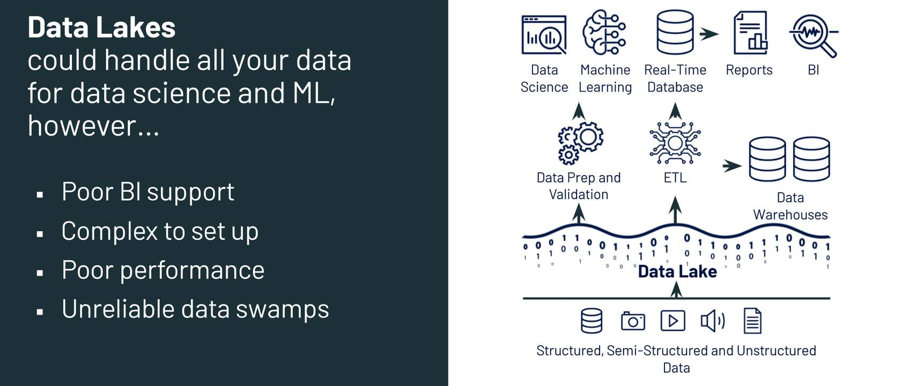
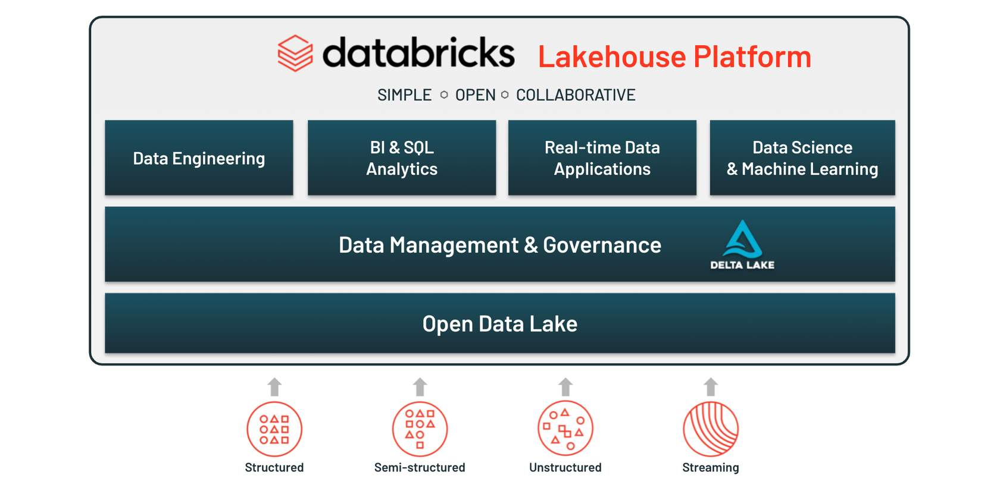

## Delta lake

Delta lake is an open format storage layer that puts standards in place in an organization's data lake to provide data structure and governance. A storage solution specifically designed to work with Apache Spark.

Data stored under delta lake is ACID compliant.

### Short Comings Of A Data Lake

#### Data Lakes Offer -

- Flexibility in data storage
- Relatively cheaper compared to a warehouse
- Can store structured, semi-structured or unstructured data

#### Another Challenges with Data Lakes - 

- Long storage periods & variety of data can convert it into a data swamp
  - Data swamps are data lakes that are difficult to manage and navigate
- Reading and writing data is not reliable
  - Need to build workarounds to ensure readers always see consistent data during writes
- Jobs often fail midway
  - Difficult to recover the correct state of the data
  - Countless hours are spent troubleshooting failed jobs and getting a valid state of the data
- Modification of existing data is difficult
  - Lakes are meant for data written once and read many times
  - The concept of modifying or deleting data wasn’t of central importance at the time they were designed
- Keeping historical version of data is costly
  - Can become expensive and difficult with large scale data
- It is difficult to handle large metadata
  - Reading metadata can often create substantial delays in processing and overhead costs
- Too many files cause problems
  - Query performance suffers greatly when a small amount of data is spread over too many files
- It is hard to get great performance
  - Tuning jobs is a difficult task
  - Great performance should be easy to achieve
- Data quality issues affect analysis results
  - No built-in quality checks like Data Warehouses
  - expensive, long-running queries may fail or produce meaningless results

#### How does Delta Lake resolve the above issues?

Acid Transactions

- Each transaction has a distinct beginning and end
- Appending data is easy and each new write will create a new version of the table
- New data won't be read until the transaction is complete
- Jobs that fail midway can be discarded entirely
- Many changes can be applied to the data in a single transaction, eliminating the possibility of incomplete deletes or updates

Schema Management

- Specify and enforce schema
- Schema validation during writes
- Throws an exception if extra data is added
- Can make changes to tables schema

Scalable Metadata Handling

- Metadata is processed just like regular data - with distributed processing

Unified Batch and Streaming data

- Supports both streaming and batch processes
- Each micro-batch transaction creates a new version of a table

Data Versioning and Time Travel

- A maintained version of historical data
- Databricks uses Spark to scan the transaction logs for efficient processing

### Why Delta Lake

By bringing the structure and governance inherent to data warehouses to data lakes with Delta Lake, you create the foundation for a Lakehouse.

#### Delta Lake Features - 

- ACID transactions on Spark
- Scalable metadata handling
- Streaming and batch unification
- Schema enforcement
- Time travel
- Upserts and deletes
- Fully configurable/optimizable
- Structured streaming support

#### Delta Lake Storage Layer -

- Highly performant and persistent
- Low-cost, easily scalable object storage
- Ensures consistency
- Allows for flexibility

#### Delta Tables -

- Contain data in Parquet files that are kept in object storage
- Keep transaction logs in object storage
- Can be registered in a metastore

### Elements of Delta Lake

#### Delta Files

- Uses parquet files to store a customer's data
- Provide an additional layer over parquet files
  - data versioning and metadata
  - stores transaction logs
  - provides ACID transactions

#### Delta Tables

A delta table is a collection of data kept using the Delta Lake technology and consists -

- Delta files containing the data and kept in object storage
- A Delta table registered in a Metastore
- The delta transaction log saved with Delta files in object storage

#### Delta Optimization Engine

- Delta Engine is a high-performance query engine that provides an efficient way to process data in data lakes.

#### **Delta Lake Storage Layer**

#### What is the Delta transaction log?

- Ordered record of the transactions performed on a Delta table
- Single source of truth for that table
- Mechanism that the Delta Engine uses to guarantee atomicity