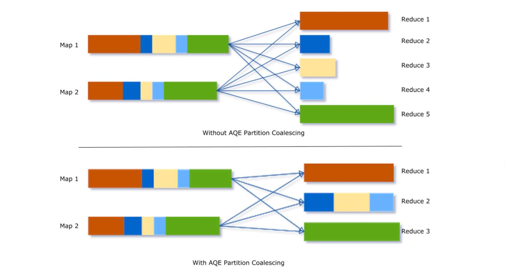
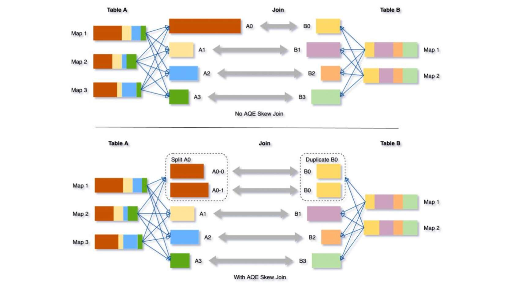
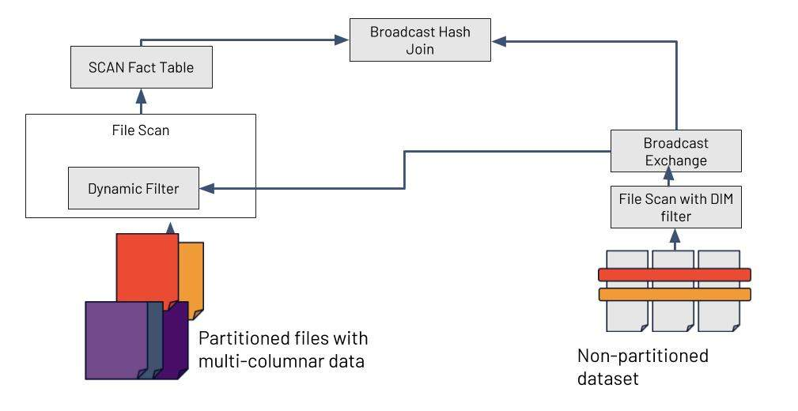

# What's new in Spark 3?

### Adaptive Query Execution

In Spark 2, the logical and physical optimizations were rule based optimizations. While they improve the performance, they are all based on the estimates and statistics that are generated before runtime. There may be unanticipated problems or tuning opportunities that appear as the query runs.

Adaptive Query Execution allows Spark to re-optimize and adjust query plans based on runtime statistics collected during query execution.

When AQE is on, spark will feed back statistics about the size of the data in the shuffle files, so that for the next stage, when working out the logical plan, it can dynamically switch join strategies, coalesce number of shuffle partitions or optimize skew joins.

#### Switch Join Strategies

Existing rule-based optimizations include planning a broadcast hash join if the estimated size of a join relation is lower than the broadcast-size threshold. It relies on a estimation of data based on the file size. A number of things can make the estimation go wrong - 

- Presence of a very selective filter
- Join relation being a series of complex operators other than just a scan

To solve this problem, AQE now replans the join strategy at runtime based on the most accurate join relation size. So if the estimated file size was 20MB and the actual file size turns out to be 8MB after the scan, then AQE will dynamically switch the join strategy from Sort-Merge Join to Broadcast-Hash Join.

#### Coalesce Shuffle Partitions

Tuning shuffle partitions in Spark is a common pain point. The best number of partitions depend on the data size, but the data sizes may differ vastly from stage to stage so this number can be hard to tune.

- If there are too few partitions -
  - then the data size of each partition may be very large, and the tasks to process these large partitions may need to spill the data to disk and as a result slow down the query.
- If there are too many partitions -
  - then the data size of each partition may be very small, leading to too many network data fetches to read the shuffle blocks. Which will also slow down the query because of inefficient I/O pattern. Having a large number of tasks also puts more burden on the task scheduler.

To solve this problem, we can set a relatively large number of shuffle partitions at the beginning, then combine the adjacent small partitions into bigger partitions at runtime by looking at the shuffle files statistics.

For example, a small dataset of two partition is involved in a group by operation. The shuffle partition is set to 5, which leads to 5 partitions during the shuffle operation.  With AQE, the other three smaller partitions are coalesced into 1 larger partition, as a result, the final aggregation now only needs to perform three tasks rather than five.

#### Optimize Skew Joins

Data skew occurs when data is unevenly distributed among partitions in the cluster. AQE detects such a skew automatically from shuffle file statistics. It then splits the skewed partitions into smaller subpartitions, which will be joined to the corresponding partition from the other side respectively.

In the below example, AQE splits the A0 partition into two smaller partitions and joins the with B0. This leads to 5 similar sized tasks that complete nearly at the same time versus one outlier task that takes much more time than the other tasks.

### Dynamic Partition Pruning

[Dynamic Partition Pruning - Data Savvy Youtube](https://youtu.be/rwUgZP-EBZw)

